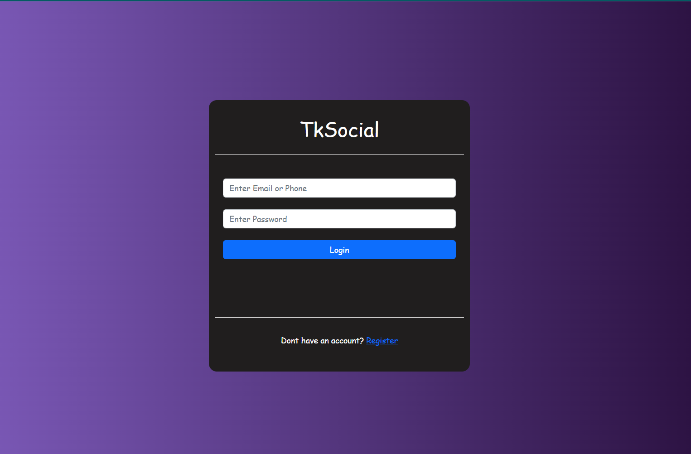
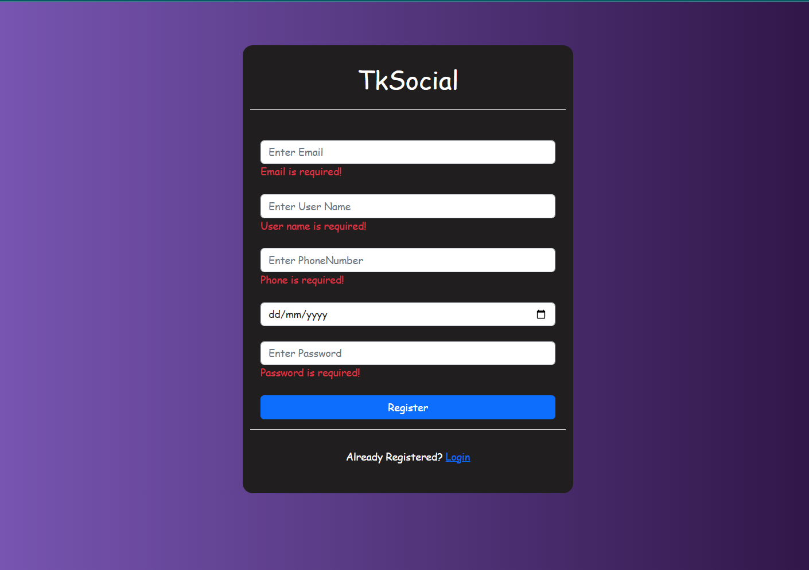
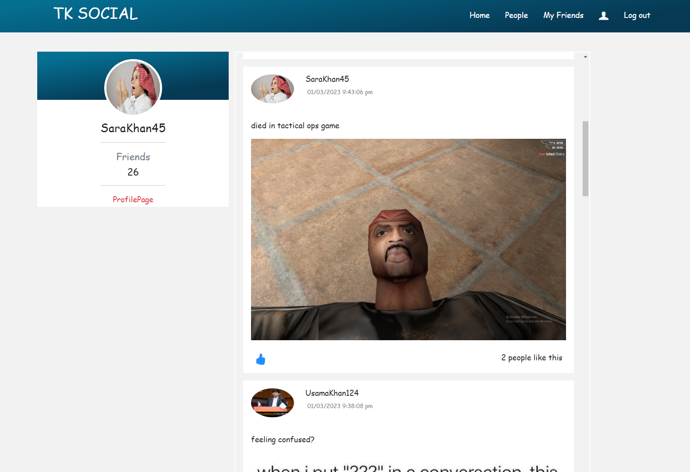
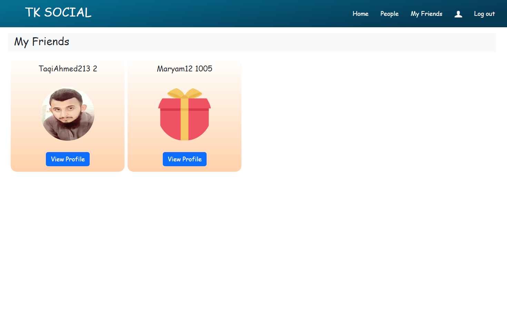
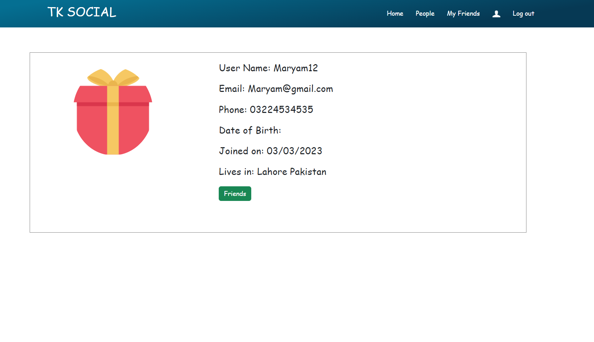
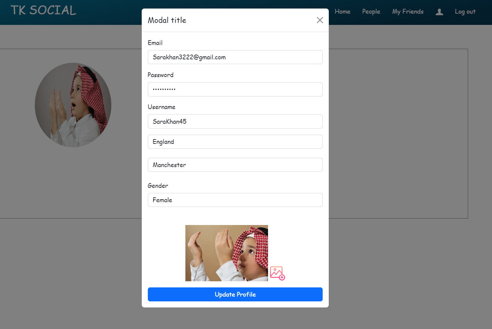
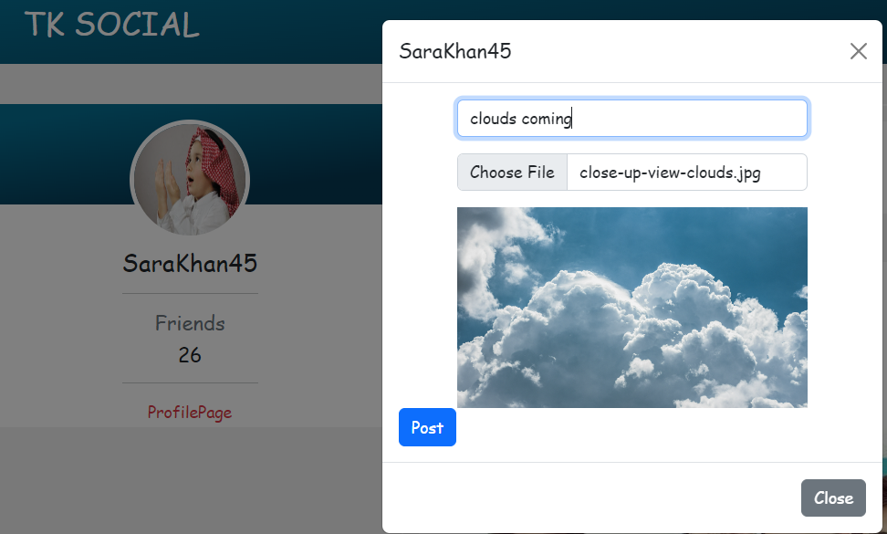

# Social Media Website in ASP.NET MVC 

This is a Social Media Website project made in asp.net mvc 5 and sql server database.

## Objectives

- Login and Registration
- Create New Posts
- Like Posts.
- Browse and Search People.
- Send Friend Request to People.
- Add or Rejecy Friend Request.
- Edit your profile including profile picture

## Tools And Languages

- C#
- Asp.net MVC
- Sql Server
- Ado.net 
- Repository pattern architecture
- git
## Project Working

### Login Page

### Register Page

### Homepage

### My Friends

### All People

### Others Profile

### own Profile

### edit Profile

### add post

